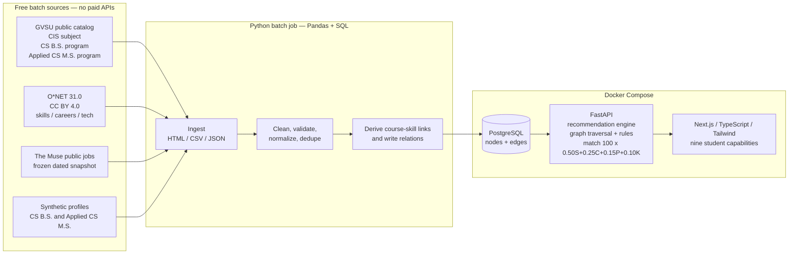
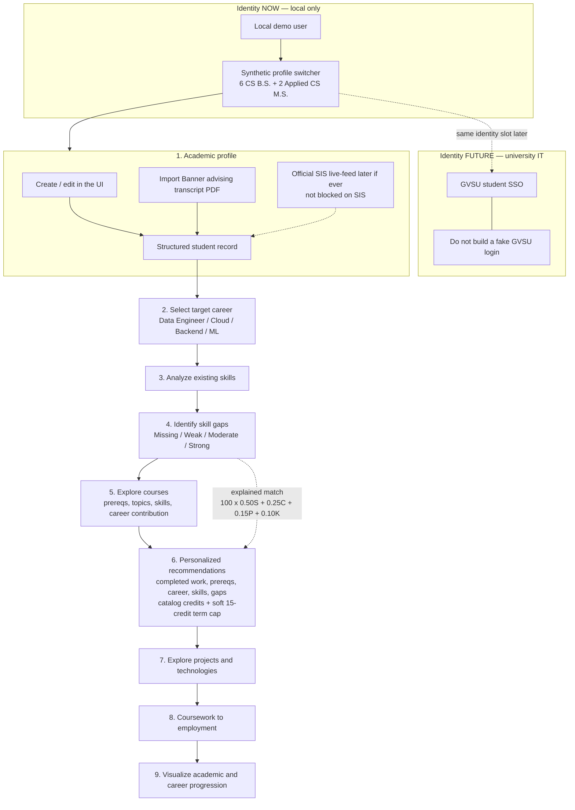
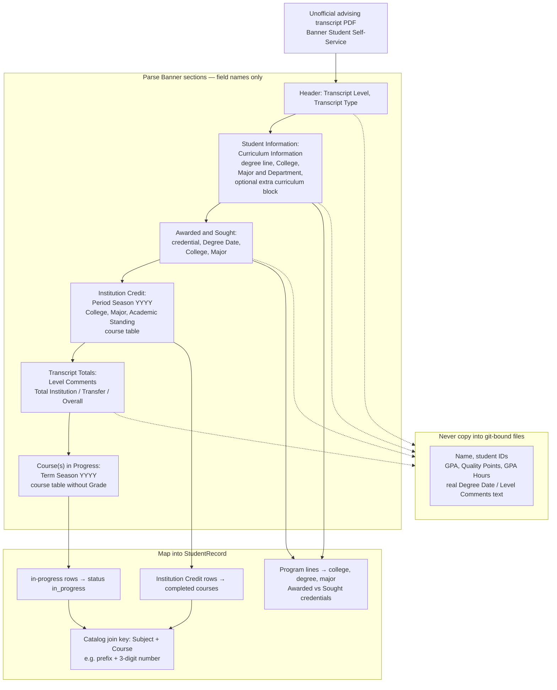
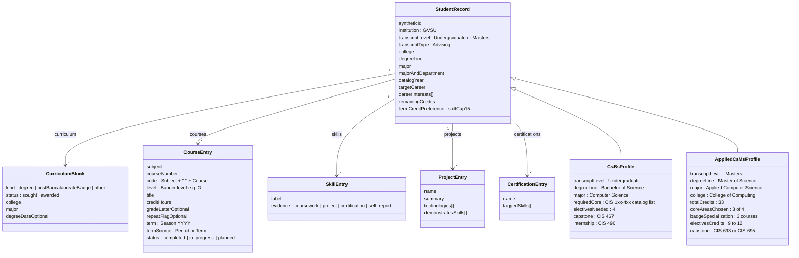

# StudentOS — Milestone 3 architecture diagrams

**Project:** StudentOS — a data-driven student decision intelligence platform  
**For:** Muhammad Bilal Ali Khan (supervisor-ready intended shape)  
**Status:** Drawn to match the **LOCKED** [decision memo](decision-memo.md) (Bilal, 2026-09-18, with amendments).  
**This ships:** four diagrams only. **Not yet:** application code, extra diagram types, multi-institution drawings.

Kept from the proposal: Python + PostgreSQL + Pandas/SQL; batch pipeline; graph traversal + explicit rules (no ML requirement).

Locked stack in one line: **free sources** (GVSU public CS B.S. + Applied CS M.S. catalog, O\*NET 31.0, The Muse public jobs snapshot, synthetic profiles) → **Python / Pandas** batch → **PostgreSQL node+edge tables** → **FastAPI** recommendation API → **Next.js / TypeScript / Tailwind** UI, all via **Docker Compose**. Local demo identity now; GVSU SSO later (university IT). No Neo4j. No paid APIs. No fake campus passwords. No real transcripts in git.

---

## 1. Batch pipeline (locked tools named)

PDF shape, with the locked products filled in: sources → Python ingest → clean/transform → PostgreSQL → recommendation engine → web app. Compose runs Postgres, the API, and the web UI. The batch job is an on-demand Python command, not a fourth always-on service.

Transcript import is **not** a pipeline source. It is a local UI/API path onto the same student nodes (see diagram 3). The test file is an unofficial **Banner Student Self-Service Academic Transcript (Advising)** PDF; keep it out of git. Import maps **field names and code patterns** only — never copy names, IDs, GPAs, or other PII into this repo.



**How to read it.** Heterogeneous public/synthetic inputs are combined once per pipeline run. PostgreSQL is the system of record for both tabular fields and the traversable graph. FastAPI sits next to that database so scoring and recommendations stay in Python. The web app does not talk to O\*NET or The Muse at request time.

---

## 2. Entities and the five proposal graph relations

Storage is **PostgreSQL**, not Neo4j:

- `nodes(id, type, properties)`
- `edges(src, rel, dst, properties)`

Node types we store: student, course, skill, project, technology, career, job. **Locked edges are only the five relations the proposal names.** Career and technology are first-class nodes (needed for match scores and “explore technologies”) but are not extra locked edge types.

```mermaid
flowchart TB
  subgraph tables ["PostgreSQL — same database as the pipeline"]
    N["nodes(id, type, properties)"]
    E["edges(src, rel, dst, properties)"]
    N --- E
  end

  subgraph graph ["Five locked relations"]
    Student["Student"]
    Course["Course"]
    Course2["Course"]
    Skill["Skill"]
    Project["Project"]
    Job["Job"]

    Student -->|"completed"| Course
    Course -->|"teaches"| Skill
    Course -->|"prerequisite of"| Course2
    Project -->|"demonstrates"| Skill
    Skill -->|"required by"| Job
  end

  subgraph extraNodes ["Stored node types without extra locked edges"]
    Career["Career<br/>Data Engineer / Cloud / Backend / ML"]
    Tech["Technology<br/>e.g. Kafka, Airflow, Terraform"]
  end

  tables --> graph
```

**Traversal the prototype must support:** student → completed courses → taught skills → skills required by a target job/career → remaining skill gaps → candidate courses (walk prerequisite_of with a recursive CTE) and candidate projects (demonstrates). That is the Data Engineer question from the proposal, as SQL, not as a second database.

---

## 3. Student path through the nine capabilities

Identity **now** is a local demo user plus a switcher across the synthetic B.S. and M.S. profiles. **GVSU student SSO is wanted** and is drawn as future work that needs university IT. The prototype will not collect a GVSU password.

Capability 1 includes **UI create/edit and transcript import**. Official SIS live-feed is later, if ever, and does not block this path. Import is a file of the Banner **advising** transcript (the print itself says it is not official and may include in-progress courses). That is not campus SSO and not a fake GVSU password page.



**How to read it.** Capabilities 1–2 are intake. Capabilities 3–9 are the intelligence loop on top of the graph and the locked scoring rule. Dotted lines are constraints or future work, not prototype screens to build now.

### Transcript import path (Banner advising layout)

Target print: **Student Self-Service → Academic Transcript**, **Transcript Type = Advising**, with **Transcript Level** (Masters or Undergraduate). Five sections on the print, in this order: **Student Information**, **Awarded**, **Institution Credit**, **Transcript Totals**, **Course(s) in Progress**.

The transcript does **not** carry skills, projects, certifications, or target career — those stay UI fields. Coursework and program lines come from the print.



**Course-row columns to parse** (completed **Period** table): `Subject`, `Course`, `Level`, `Title`, `Grade`, `Credit Hours`, `Quality Points`, `R` (repeat). In-progress **Term** table drops `Grade` and `Quality Points`. `Level` on graduate rows is `G`. `Grade` is a letter with optional `+` / `-`. `Credit Hours` is a decimal (`n.000`). Period/term labels use GVSU seasons (**Fall**, **Winter**) plus year.

**Scoring use:** keep the letter `Grade` so the locked ≥ 2.0 coursework rule can run; convert letters on import. Do **not** use transcript GPA or quality points as the Career Match Score (that score is the locked four-factor rule).

---

## 4. Student record shape (B.S. and M.S.) — Banner field layout

One record shape, two degree levels. Fields below match the Banner advising print’s **labels and code patterns**, not any one student’s values. Synthetic rows **are** repo test data (invented courses/grades). A personal transcript parses into this same shape locally and **must not be committed**.

UI-only (not on the transcript): target career, interests, skills, projects, certifications, planned-but-not-registered courses.



**Banner → StudentOS field map** (structure only; no personal values):

| Banner label | Pattern | StudentOS field |
| --- | --- | --- |
| Transcript Level | `Masters` or undergraduate level on a B.S. print | `transcriptLevel` |
| Transcript Type | `Advising` on the test print | `transcriptType` (informational) |
| Curriculum Information → degree line | e.g. `Master of Science` / `Bachelor of Science` | `degreeLine` |
| College | e.g. `College of Computing` | `college` |
| Major and Department | `Major` or `Major, Concentration`; may end `, Undeclared` | `major` + optional concentration |
| Extra curriculum block | e.g. Post-Baccalaureate Badge + Major | `CurriculumBlock` (`awarded`) |
| Awarded / Sought | separate credential blocks with College + Major | `CurriculumBlock.status` |
| Period | `Period : Fall\|Winter YYYY` | `CourseEntry.term` (`termSource = Period`) |
| Term (in progress) | `Term : Fall\|Winter YYYY` | `CourseEntry.term` (`termSource = Term`) |
| Academic Standing | per period | optional; not used by locked scoring |
| Subject + Course | letter prefix + 3-digit number (CIS, SE, …) | `code` for catalog join |
| Level | `G` on graduate rows | `level` |
| Title | course title | `title` (cross-check catalog) |
| Grade | letter with optional `+`/`-` | `gradeLetter` on completed rows only |
| Credit Hours | decimal hours | `creditHours` (align with catalog credits) |
| R | repeat column | `repeatFlag` |
| Quality Points / GPA / GPA Hours | period, cumulative, and totals tables | **do not store in git**; unused by locked match formula |
| Course(s) in Progress table | no Grade / Quality Points | `status = in_progress` |

**First synthetic set (locked counts):**

| Id (synthetic) | Degree | What it is for |
| --- | --- | --- |
| `synth-bs-data-eng` | CS B.S. | PDF Data Engineer example: databases + cloud + ML coursework; limited Kafka / Airflow / Terraform |
| `synth-bs-empty` | CS B.S. | New / empty profile |
| `synth-bs-backend` | CS B.S. | Backend-leaning |
| `synth-bs-ml` | CS B.S. | ML-leaning |
| `synth-bs-missing-prereq` | CS B.S. | Missing prerequisites |
| `synth-bs-heavy-load` | CS B.S. | Heavy remaining credit load |
| `synth-ms-data-eng` | Applied CS M.S. | Data Engineering-track graduate (e.g. CIS 660 / databases / cloud); same Kafka / Airflow / Terraform gap |
| `synth-ms-empty` | Applied CS M.S. | New / empty M.S. profile |

No real names, student IDs, GPAs, quality points, degree dates, level-comment text, or live grades from a test transcript belong in this file or in git. Do not copy the PDF into the GitHub repo.

---

## What these pictures are not

They are not a multi-institution schema, a lakehouse, a streaming pipeline, or an SSO implementation plan. They are the intended shape of the GVSU CS prototype after Milestone 2 locks.

**You (Bilal):** “Does this match what we locked?” — not visual polish.  
**Cursor:** no application code until that review.
